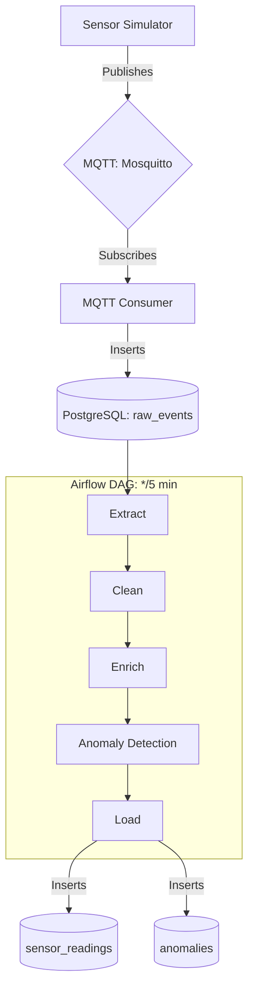

<div align="center">

# IoT ETL Pipeline

End-to-end IoT data pipeline: simulated sensors → MQTT → PostgreSQL → Airflow ETL → analytical tables.

</div>

## Architecture



## Quick Start

```bash
cp .env.example .env
docker-compose up -d
```

Airflow UI: http://localhost:8080 (admin / admin)

## Services

| Service            | Port  | Description                          |
|--------------------|-------|--------------------------------------|
| PostgreSQL         | 5432  | Primary datastore                    |
| Mosquitto (MQTT)   | 1883  | Message broker                       |
| Airflow Webserver  | 8080  | DAG management UI                    |
| Airflow Scheduler  | —     | DAG scheduling                       |
| MQTT Consumer      | —     | Ingestor: MQTT → raw_events          |
| Sensor Simulator   | —     | Generates synthetic sensor data      |

## Sensors Simulated

| Sensor ID   | Type        | Normal Range | Notes                         |
|-------------|-------------|--------------|-------------------------------|
| temp-01     | temperature | 18–26 °C     | Spikes to 40–80 °C (5%)       |
| temp-02     | temperature | 18–26 °C     | Spikes to −20–−10 °C (5%)     |
| motion-01   | motion      | 0 / 1        | Higher frequency business hrs |
| motion-02   | motion      | 0 / 1        | Low-frequency outdoor         |
| door-01     | door        | 0 / 1        | Front door                    |
| door-02     | door        | 0 / 1        | Back exit                     |

## ETL Pipeline Stages

1. **Extract** – reads unprocessed rows from `raw_events`
2. **Clean** – dedup, null filters, range validation → `dead_letter_events` for rejects
3. **Enrich** – joins `sensor_metadata`, adds `hour_of_day`, `day_of_week`, `is_business_hours`
4. **Anomaly Detection** – z-score (temperature), burst detection (motion), after-hours (door)
5. **Load** – batch inserts into `sensor_readings` and `anomalies`
6. **Mark Processed** – sets `processed=TRUE` on raw_events rows


